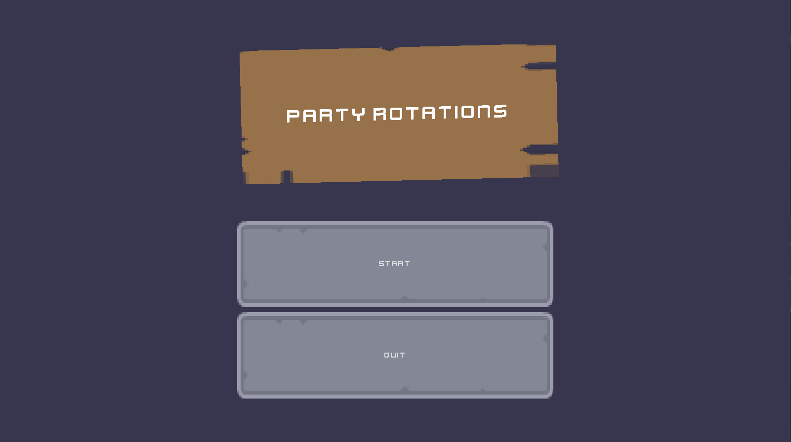

# Party Rotations
A game made with Godot 3.4 for the [Kenney Jam 2021](https://itch.io/jam/kenney-jam-2021)

### Assets used
- [1-Bit Pack](https://kenney.nl/assets/bit-pack)
- [UI Pack: RPG Expansion](https://kenney.nl/assets/ui-pack-rpg-expansion)
- [Kenney Fonts](https://kenney.nl/assets/kenney-fonts)
- [Impact Sounds](https://kenney.nl/assets/impact-sounds)

### Controls
- Right click: move unit
- Left click: cast queued skill
- (Q/W/E/R): queue skill
- (1/2/3/4): switch unit

### Skills
- Unit1
  - Q: Spear thrust
    - Thrusts a spear forward doing a little damage and knockback
  - W: Dash
    - Dash towards a given position
  - E: Spear throw
    - Throw 3 spears in a given direction doing damage and knockback
  - R: Spear bomb
    - Summon a spear at a position doing a large amount of damage
- Unit 2
  - Q: Slash
    - A short-ranged sword slash that does a little damage and knockback
  - W: Shields up
    - A slow shield bash that does a little damage, knockback, and increases defense for a bit
  - E: Snacc
    - Restore health for the entire party
  - R: Sword time
    - Buff the entire party's damage output for a short while
- Unit 3
  - Q: Water ball
    - Cast a water ball that does an okay amount of damage in a given direction
  - W: Blood rush
    - Reduces the cooldowns on the entire party's skills
  - E: Poison gas
    - Create a poison cloud that does 1 tick of damage at a given position
  - R: Ice line
    - Cast an ice ball that creates smaller ice balls that do damage
- Unit 4
  - Q: Grasping roots
    - Create roots at a given position that do some damage
  - W: Miracle growth
    - Creates a tree at a given position that obstructs movement
  - E: Blasphemous totem
    - Creates a totem at a given position that heals the party
  - R: Hidden path
    - Quickly travel to a location and reduce the entire party's skill cooldowns

